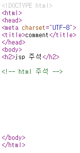

# Servlet

- Controller: 요청~응답 제어(Controller)
- java code + out.println(`<html>`)

# JSP

- View: 정적+동적 화면
- html tag + java code (`<% java code %>`)

# Java Class

- Model : Serviece
- Model : DAO
- Model : DTO => DB Table Mapping
- params, args type
  - domain 속성: 아이디(String), 비밀번호(String)
  - domain 객체: DTO
  - collection 객체: Array, List, Set, Map

## jsp 페이지 구성 요소

1. html tag, plain-text
2. jsp tag: 5개
3. jsp action tag
4. EL/JSTL
5. Cusom Tag: 사용자 정의 태그, F/W 정의 태그

## jsp 페이지 수행 절차

1. hello.jsp
2. java 소스코드 자동 변환: hello_jsp.java
3. java 소스코드 자동 컴파일: hello_jsp.class
4. jsp class 로딩
5. jsp 객체 생성
6. jspInit() 초기화 메서드 수행
7. \_jspService() 서비스 메서드 수행
8. jspDestroy() 자원해제 메서드 수행

---

    2. java 소스코드 자동 변환: hello_jsp.java

    - jsp tag: <% java code %>, <%= expression %>
    - .jsp => .java 변환 시에 \_jspService() {서비스 수행코드로 자동 변환}
    - 내장 객체: \_jspService() 자동 변환시에 내부에 자동으로 제공하는 객체
    - 따라서, 내장 객체는 <% java code %>, <%= expression %> 에서만 사용 가능

## 내장 객체 종류

- PageContext pageContext;
- HttpSession session = null;
- ServletContext application;
- ServletConfig config;
- JspWriter out = null;
- Object page = this;

## jsp tag: 5가지

1. 주석태그

   - `<!-- html 주석 태그 -->`
     - 응답시에 함께 전송, 사용자 보기 가능. 주로 페이지 레이아웃 관련 주석
   - `<% // java 한줄 주석 %>` / `<% /* java 여러 줄 주석 */ %>`
     - hello.jsp => (java code 변환) hello_jsp.java 포함되는 주석 : 개발자를 위한 것
   - `<%-- jsp 주석 --%>`

     - jsp 페이지에서만 보기 위한 주석
     - java code 변환시에 포함되지 x
     - <%-- 주석 내용이 코드 실행문이면 실행 결과를 주석으로 처리 --%>
     - ★주의사항 : jsp 코드는 주석내용으로 하지말 것!!!!★

       
     => html 주석은 사용자에게 노출된다

2. Directive Tag: 지시어 태그

- 형식: `<%@ 지시어 속성명 = "속성값" 속성명='속성값' %>`
- 지시어 종류
  (1) page: jsp -> java 변환시 제공하는 정보  
  (2) taglib: jstl 사용시에 선언  
  (3) include: 조각 페이지 사용시에 선언/ `<jsp:include> action tag`

- page 지시어
  ```
  <%@ page contentType="text/html; charset=utf-8"
          import = "java.util.*, com.ssafy.model.*"
          errorpage="오류 처리를 위한 페이지 url"
          isErrorPage="false|true"
    %>
  ```
  - import는 여러번 사용 가능
  ```
  <%@ page import="java.util.ArrayList" %>
  <%@ page import="com.ssafy.model.BoardDto" %>
  ```

3. Declaration Tag: 정의어 태그

- 형식:

```
<%!
  // 멤버변수 선언문
  // 메서드 선언문
  // jsp 라이프 사이클 메서드 재정의: 초기화 메서드, 자원해제 메서드
%>
```

4. Expression Tag: 수식 태그

- 형식:`<%= 값 | 변수명 | 수식 | 값을 반환하는 메서드 수행문() | new 객체 생성()  %>`
- 해당 코드는 \_jspService() 서비스 메서드의 내부 수행 코드로 변환
- jsp 내장 객체 사용 가능: jsp가 java 변환 시에 \_jspService() 내부에 선언한 내장객체
- 주의사항: 수식문 뒤에 ";" 와서는 절대 안된다! `out.println(값);` 으로 변환되는 태그.  
  `<%= doA(); %> => out.println(doA(););` => java 문법오류, 컴파일 오류 발생  
  `<%= name; %> => out.println(name;);` => java 문법오류, 컴파일 오류 발생

5. Scriptlet Tag: java 서비스 코드

- 형식: `<% service java 수행코드; %>`
- 해당 코드는 \_jspService() 서비스 메서드의 내부 수행 코드로 변환
- jsp 내장 객체 사용 가능: jsp가 java 변환 시에 \_jspService() 내부에 선언한 내장객체
- `<% 지역 변수 선언 %>` : 지역 변수 사용시에는 먼저 선언 한 후에 사용 가능함!!!!
- ex)

  ```
  이름(멤버 변수 - 선언 위치 상관 X): <%= name %>
  지역 이름: <%= courseName %> // 오류!!! <%%>는 지역변수. expression,scriptlet tag는 선언 위치 중요!
  <%!
    //멤버 변수
    String name = "유진"; // ";" 빼먹으면 안된다!!!
  %>
  <%
    //_jspService 메서드 내부에서 사용하는 지역변수
    String courseName="광주5반";
  %>
  지역이름(사용 전에 먼저 선언이 되어 있어야 한다): <%= courseName %>
  <%= courseName; %> // 컴파일 오류!!!(expression tag 내부에는 값만 위치해야 한다)
  ```

## 페이지 이동 방법

1. forward
2. redirect

## 응답위한 설정 객체 대한 scope

1. page: 현재 페이지
2. request: 요청 `setAttribute(key, value)`, `getAttribute(key) : value (type casting)`
3. session: 로그인 `setAttribute(key, value)`, `getAttribute(key) : value`, `removeAttribute(key)`
4. application: 서버 `setAttribute(key, value)`, `getAttribute(key) : value`
